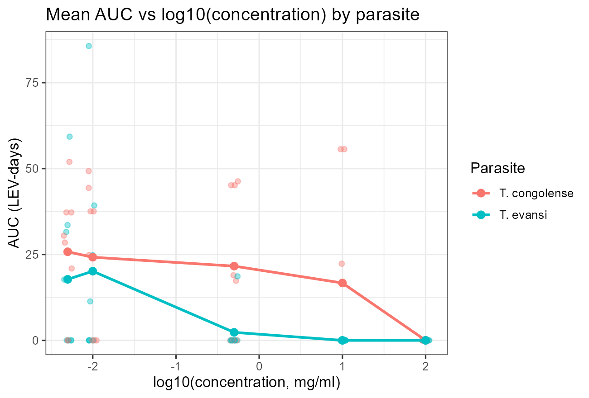
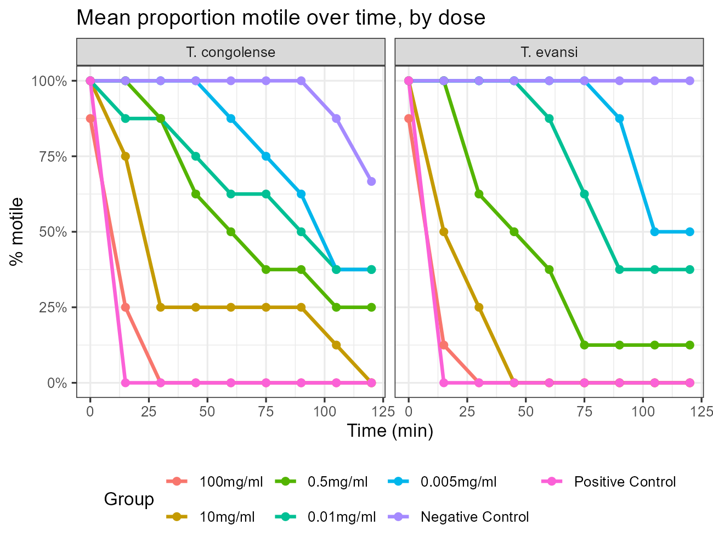
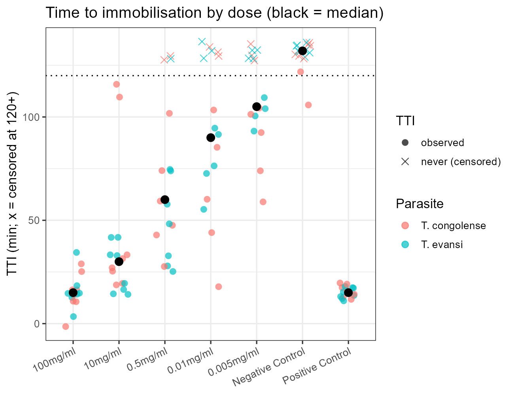
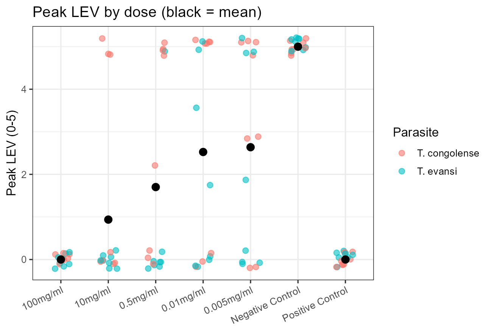
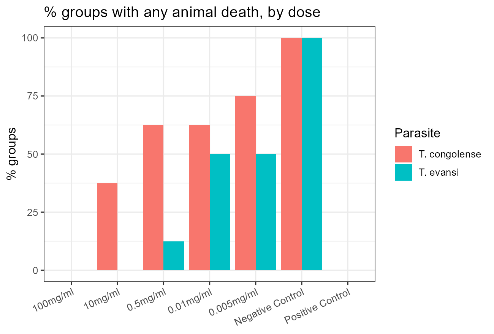
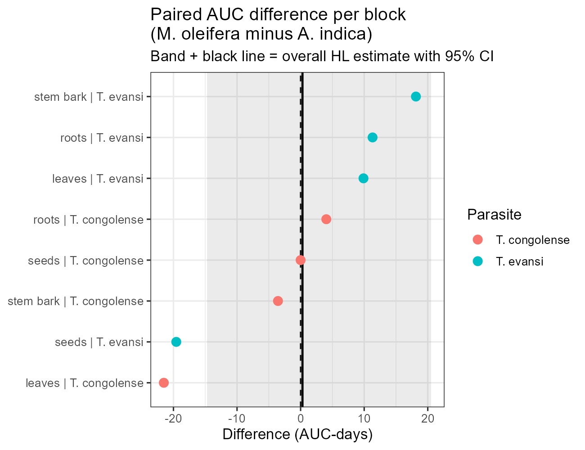
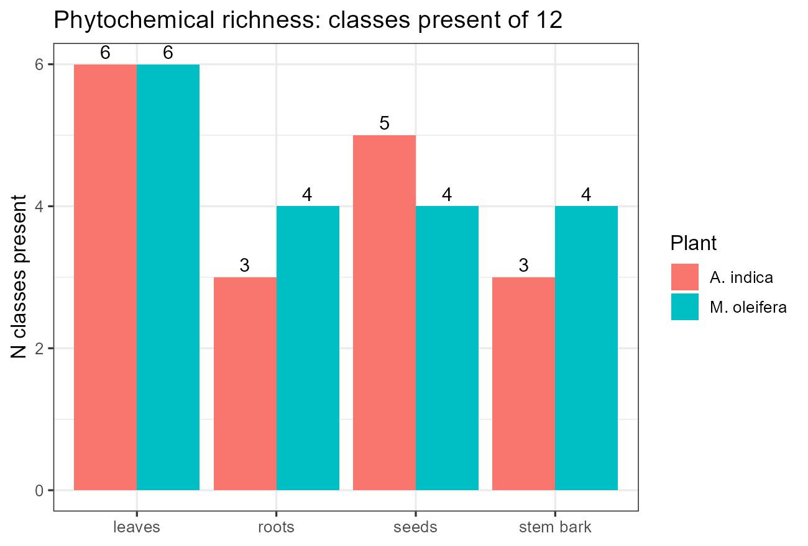
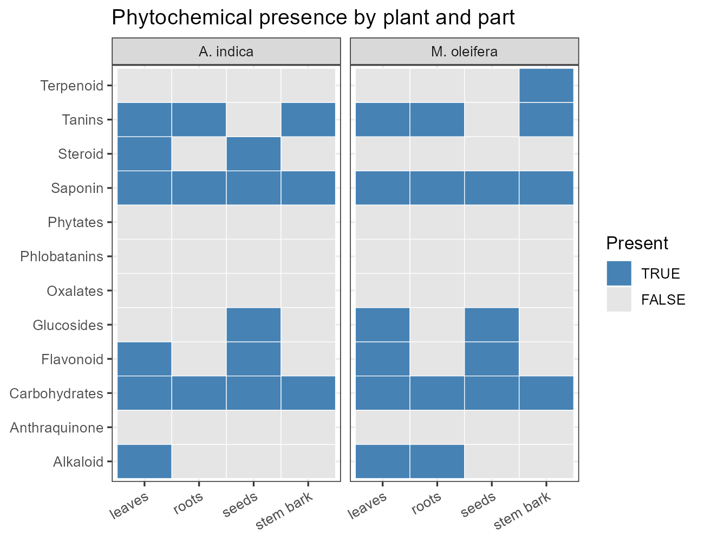

# Comparative Anti-Trypanosomal Activity of *Azadirachta indica* and *Moringa oleifera* against *Trypanosoma congolense* and *T. evansi*

A fully reproducible R + Quarto pipeline that parses a messy Excel workbook
(Sheet 2) into tidy datasets and carries out a block-level, non-parametric
statistical analysis — from raw spreadsheet to thesis-ready Word report.

**Headline findings:** both plant extracts are dose-dependently
trypanocidal with 100 mg/ml fully suppressive (peak parasitaemia zero, no
mortality) against peak LEV 5 with universal mortality in Negative Controls;
*T. evansi* is the more dose-sensitive parasite (top three doses beat control,
Holm-adjusted p = 0.039); *T. congolense* responds suggestively at 100 mg/ml
only; the two plants are statistically indistinguishable (paired p = 1.0).

## Repository layout

```text
.
├── Works on A indica and M oleifera of T congo and T evansi.xlsx  # source (read-only)
├── TITLE AND STATISTICAL ANALYSIS.docx                            # thesis aim/objectives excerpt
├── AGENTS.md                                                      # agent working notes (quirks, commands)
├── analysis/
│   ├── R/
│   │   ├── 01_build_datasets.R    # Sheet 2 parser → tidy CSVs
│   │   ├── 02_analysis.R          # block-level statistics → tables + figures
│   │   ├── render_methods_docx.R  # objectives×methods Word doc (officer/flextable)
│   │   ├── make_templates.py      # Word templates (Times New Roman + APA tables)
│   │   ├── render_docx.R / render_rmd.R  # plan-document renderers
│   │   └── template-tnr.docx
│   ├── data/                      # 6 tidy CSVs (+ xlsx mirrors)
│   ├── plans/                     # analysis plan (.md/.Rmd/.docx)
│   ├── results/
│   │   ├── tables/                # 20 result CSVs (endpoints, tests, diagnostics)
│   │   └── figures/               # 15 PNGs (see screenshots below)
│   └── reports/
│       ├── report.qmd             # Quarto source of the statistical report
│       ├── report.docx            # thesis chapter (Times New Roman, APA tables)
│       ├── report.html            # self-contained review build
│       ├── objectives-methods.docx# objectives × variables × methods companion
│       └── reference-doc.docx     # Quarto Word template
```

## Requirements

- **R 4.5.x** (verified 4.5.2) with: `readxl, dplyr, tidyr, stringr, readr,
  ggplot2, rstatix, PMCMRplus, broom, officer, flextable, magrittr`
- **Quarto ≥ 1.9** (for `report.qmd` → `.docx`/`.html`)
- **Python 3 + python-docx** (only for regenerating the Word templates)

## Reproduce everything (4 commands, from the repo root)

```bash
Rscript analysis/R/01_build_datasets.R   # parse Sheet 2 → analysis/data/*.csv
Rscript analysis/R/02_analysis.R         # statistics → results/tables + results/figures
quarto render analysis/reports/report.qmd          # → report.docx + report.html
Rscript analysis/R/render_methods_docx.R # → objectives-methods.docx
```

> Do not pass `--output-dir` to the quarto render (it nests outputs one level
> too deep), and never hand-edit CSVs — regenerate. Structural `stopifnot`
> guards fail fast on layout drift.

## Data

Each CSV row is a **group mean of n = 3 mice**; the analytical unit is the
plant × part × parasite **block (N = 16)**.

| File | Rows | Content |
|---|---|---|
| `parasitemia.csv` | 4480 = 16 × 7 × 40 | LEV 0–5 by day (+ `lev_raw` pre-cap column) |
| `weight.csv` / `pcv.csv` | 336 each | Pre / Infection / Post-Infection |
| `motility.csv` | 1008 = 16 × 7 × 9 | +/− motility over 0–120 min |
| `phytochemical.csv` | 96 = 12 × 4 × 2 | presence/absence per compound × part × plant |
| `data_dictionary.csv` | — | column notes and cleaning flags |

Known quirks (all handled in the parser, see `AGENTS.md`): merged cells
flatten group labels (assign by position); a split `Negative`/`control`
label row; `root` vs `roots`; Azadirachta phytochemical columns offset by
one; 42 above-scale LEV readings capped to 5 and flagged; `+-` motility set
to NA; NA = animal died (adopted convention).

## Methods in brief

Rank-based throughout (LEV ordinal, N small): Friedman tests blocked by
block for dose trends with Spearman log-dose correlations; paired Wilcoxon
signed-rank post-hocs (Holm per parasite) and plant/parasite contrasts with
matched-pairs rank-biserial effects and Hodges–Lehmann median differences
with 95% CIs. Exact p-values where tie-free, normal approximation otherwise;
leave-one-block-out sensitivity on all headline claims. No machine learning.

## Results — screenshots

### Dose response: cumulative parasite burden falls with concentration



*T. evansi*: Friedman p = 0.006; 100/10/0.5 mg/ml beat control in all eight
blocks (Holm 0.039). *T. congolense*: Friedman p = 0.074; 100 mg/ml
suggestive (Holm 0.071).

### In-vitro kill curves fan out cleanly by dose



100 mg/ml immobilises within 15–30 min in both parasites; Negative Controls
stay motile. Blocked trend p < 0.001 for both parasites.

### Time to immobilisation lengthens monotonically as dose falls



Median TTI: 15 min (100 mg/ml) → fully censored controls; Positive Controls
kill like the top dose, validating the assay.

### Peak parasitaemia and mortality track dose together




100 mg/ml: mean peak zero with no deaths in both parasites. Negative
Controls: peak LEV 5 with universal mortality.

### No superior plant — paired differences straddle zero



Eight pairs split both ways with one exact tie (paired p = 1.0; HL 0.3,
95% CI −14.7 to 20.5).

### Phytochemistry: richness follows plant part, not species




Leaves richest (6/12 each); saponins/carbohydrates universal; tannins absent
only in seeds — heavy chemical overlap consistent with interchangeable
efficacy.

## Key documents

- **`analysis/reports/report.docx`** — full statistical report (thesis
  chapter): aim, methods, results per objective, diagnostics, discussion
  against recent literature, limitations, references. Times New Roman, APA
  tables.
- **`analysis/reports/objectives-methods.docx`** — companion table mapping
  each objective to variables, methods, expected answers and handling rules.
- **`analysis/reports/report.html`** — same report as a self-contained page.

## References (methods)

Conover (1999); Mann & Whitney (1947); Wilcoxon (1945); Cliff (1993, 1996),
Vargha & Delaney (2000); Spearman (1904); Noyes et al. (2009); Naessens et
al. (2005); Gitonga et al. (2017). substantive literature is discussed in
the report (§7): Rabe et al. (2024), Ujah et al. (2020), Datti et al.
(2020), Tauheed et al. (2021), Wanzala et al. (2017), Sirak et al. (2024),
Ogbole et al. (2021).
